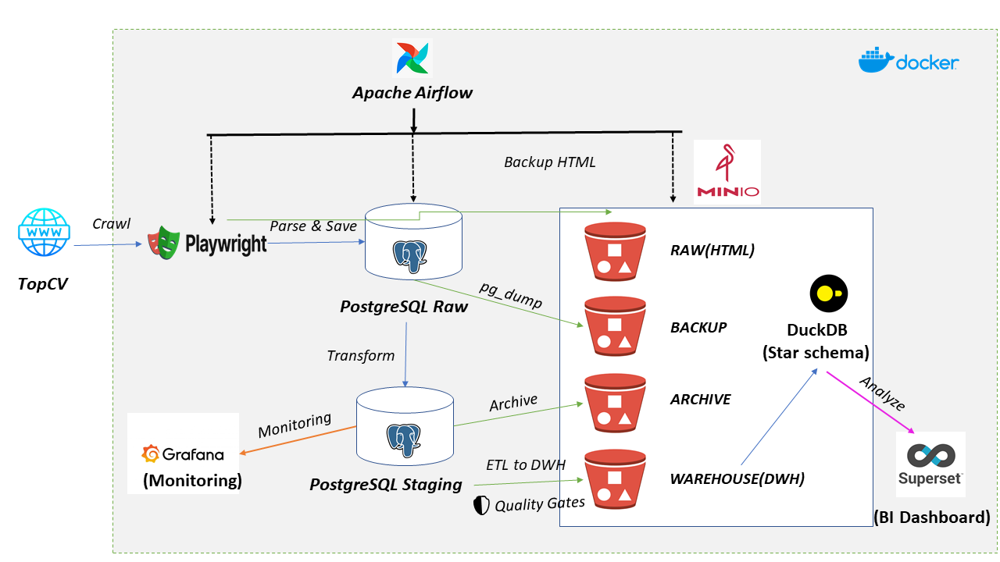
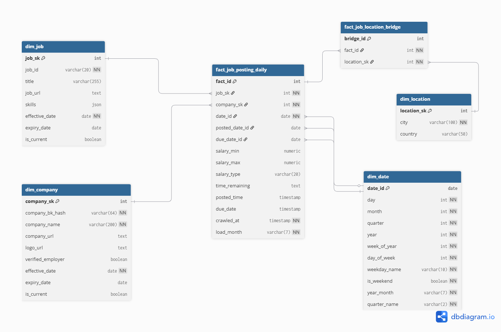

# 🎯 JobInsight Data Pipeline

[](https://python.org)
[](https://airflow.apache.org)
[](https://docker.com)
[](LICENSE)

> **End-to-end Data Pipeline** crawling IT jobs from TopCV.vn → **Star Schema DWH** → Analytics dashboards

**Highlights**:
- 🕷️ Production-grade web scraping with anti-detection
- 🏛️ Kimball dimensional modeling (SCD Type 2, Periodic Snapshot)
- 🛡️ Multi-layer quality validation & automated monitoring
- 📊 Modern data stack (Airflow, PostgreSQL, DuckDB, MinIO)

---

## 📑 Table of Contents

- 🏛️ [Architecture](#-architecture)
- ⚡ [Key Features](#-key-features)
- 🚀 [Quick Start](#-quick-start)
- 🌟 [Star Schema](#-star-schema)
- 📚 [Documentation](#-documentation)
- 🛠️ [Tech Stack](#-tech-stack)
- 💡 [Lessons Learned](#-lessons-learned)

---

## 🏛️ Architecture



### System Components

| Component | Technology | Purpose |
|-----------|------------|---------|
| **Orchestration** | Apache Airflow 2.7 | DAG scheduling, workflow management |
| **OLTP Database** | PostgreSQL 13 | Raw & staging data storage |
| **OLAP Database** | DuckDB | Data Warehouse (Star Schema) |
| **Object Storage** | MinIO | HTML backups, archives, DWH files |
| **Web Scraping** | Playwright | Anti-detection crawler |
| **Monitoring** | Grafana | Pipeline metrics & data quality |
| **Analytics** | Apache Superset | Business intelligence dashboards |
| **Infrastructure** | Docker Compose | Multi-container environment |

---

## ⚡ Key Features

### 🕷️ Production-Grade Web Scraping
- Anti-bot detection (random UA, human-like behavior, circuit breaker)
- Retry logic with exponential backoff
- Multi-selector fallback for resilient parsing

### 🏛️ Kimball Dimensional Modeling  
- Pure Periodic Snapshot with carry-forward logic
- SCD Type 2 for tracking historical changes
- Bridge table for many-to-many relationships

### 🛡️ Multi-Layer Data Quality
- 3-layer validation (Crawl → Business Rules → Staging)
- Quality gates with hard fail (≥90% valid rate)
- Automated monitoring & alerts

> � **Details**: [ARCHITECTURE](docs/ARCHITECTURE.md) | [Data Quality Rules](docs/governance/data_quality_rules.md)

---

## 🛠️ Tech Stack

### Data Engineering
- **Python 3.9+** - Core language
- **Apache Airflow 2.7** - Workflow orchestration
- **Playwright** - Headless browser automation
- **Pandas + PyArrow** - Data transformation & Parquet I/O

### Databases & Storage
- **PostgreSQL 13** - OLTP (raw_jobs, staging_jobs, monitoring)
- **DuckDB** - OLAP warehouse with Star Schema
- **MinIO** - S3-compatible object storage

### Visualization & Monitoring
- **Grafana 10.2** - Pipeline monitoring
- **Apache Superset 3.0** - Business intelligence
- **Docker Compose** - Multi-container orchestration

---

## 🚀 Quick Start

### Prerequisites
- **Docker** & **Docker Compose** (v4.22+)
- **RAM**: 8GB+ recommended
- **Ports**: 8080, 8088, 3000, 9000, 9001, 5434

### Installation

```bash
# 1. Clone repository
git clone https://github.com/Trantuan24/JobInsight_Data_Pipeline_v2.git
cd JobInsight_Data_Pipeline_v2

# 2. Create environment file
cp .env.example .env

# 3. Start all services (first run: 5-10 minutes)
docker compose up -d

# 4. Check service health
docker compose ps
```

### 🌐 Access Services

| Service | URL | Login |
|---------|-----|-------|
| **Airflow** - Pipeline Orchestration | [localhost:8080](http://localhost:8080) | `admin` / `admin` |
| **Grafana** - Pipeline Monitoring | [localhost:3000](http://localhost:3000) | `admin` / `admin` |
| **Superset** - Business Analytics | [localhost:8088](http://localhost:8088) | `admin` / `admin` |
| **MinIO** - Object Storage Console | [localhost:9001](http://localhost:9001) | `minioadmin` / `minioadmin` |

### ▶️ Run Your First Pipeline

```bash
# Trigger main pipeline (or wait until 6:00 AM daily)
docker exec jobinsight-airflow-webserver-1 \
  airflow dags trigger jobinsight_pipeline

# Check status
docker exec jobinsight-airflow-webserver-1 \
  airflow dags list-runs -d jobinsight_pipeline

# View real-time logs
docker compose logs -f airflow-scheduler
```

**Expected flow**: Crawl (2min) → Parse → Validate → Staging → DWH → Done! ✅

> 💡 **First run**: Pipeline DAG (6AM) → DWH DAG (7AM). Check Grafana for metrics!

---

## 🔄 Data Flow

```
TopCV.vn → Playwright Crawler
    ↓
PostgreSQL (raw → staging)  
    ↓
DuckDB Star Schema (MinIO)
    ↓
Grafana (Monitoring) + Superset (Analytics)
```

**4 Daily DAGs**: Maintenance (3AM) → Pipeline (6AM) → DWH (7AM) → Archive (Sun 2AM)

> 📖 **Details**: [ARCHITECTURE](docs/ARCHITECTURE.md#data-flow) | [DAG Documentation](docs/ARCHITECTURE.md#orchestration)

---

## 🌟 Star Schema



**Fact**: FactJobPostingDaily (Pure Periodic Snapshot, grain: 1 job × 1 day)  
**Dimensions**: DimJob (SCD2) • DimCompany (SCD2) • DimLocation • DimDate (role-playing)  
**Bridge**: FactJobLocationBridge (many-to-many: jobs × locations)

> 📖 **Details**: [Bus Matrix](docs/governance/bus_matrix.md) | [Data Contracts](docs/data_contracts/) | [DBML Schema](docs/dwh_schema.dbml)


---

## 📚 Documentation

### Core Documentation
- 📖 [Architecture](docs/ARCHITECTURE.md) - System design, carry-forward logic, data flow
- 🛠️ [Development Guide](docs/DEVELOPMENT.md) - Setup, workflow, code structure
- 🚨 [Troubleshooting](docs/TROUBLESHOOTING.md) - Common issues & solutions

### Data Governance
- 📋 [Data Contracts](docs/data_contracts/) - YAML schema definitions (ODCS v3.1)
- 🎯 [Bus Matrix](docs/governance/bus_matrix.md) - Dimensional relationships
- ✅ [Data Quality Rules](docs/governance/data_quality_rules.md) - Validation thresholds
- 🗄️ [Retention Policies](docs/governance/retention_policies.md) - Data lifecycle management

### Infrastructure
- 🪣 [MinIO Guide](docs/infrastructure/minio_guide.md) - Object storage setup
- 📊 [Grafana & Superset](docs/infrastructure/grafana_superset_guide.md) - Visualization tools

---

## 💡 Lessons Learned

### ✅ What Went Well
- **Kimball methodology** - Star schema made analytics simple & fast
- **DuckDB on MinIO** - $0 OLAP warehouse with Parquet exports
- **Quality gates** - Multi-layer validation catches >95% issues
- **Docker Compose** - Easy local dev & reproducible builds

### 🔥 Key Challenges
- **Multi-location jobs** → Solved with Bridge table
- **SCD Type 2** → Unique index on `(bk WHERE is_current = TRUE)`
- **Anti-detection scraping** → Circuit breaker prevents IP bans
- **DuckDB + Superset** → Remove `:ro` from volume mount

### 🚀 Future Enhancements
- More data sources (LinkedIn, Indeed)
- Real-time streaming (Kafka)
- ML models (salary prediction)
- Cloud deployment (K8s + Terraform)

---

## 🤝 Contributing

Contributions are welcome! Please follow these steps:

1. Fork the repository
2. Create a feature branch (`git checkout -b feature/amazing-feature`)
3. Commit your changes (`git commit -m 'Add amazing feature'`)
4. Push to the branch (`git push origin feature/amazing-feature`)
5. Open a Pull Request

**Guidelines**:
- Follow PEP 8 for Python code
- Add tests for new features
- Update documentation
- Run `black` and `flake8` before committing

---

## 📧 Contact

**Author**: [Duy Tuấn]

- 📧 Email: duytuan2412k4@gmail.com
- 🐙 GitHub: [@Trantuan24](https://github.com/Trantuan24)

Feel free to reach out if you have questions or want to discuss data engineering!

---

## 📄 License

This project is licensed under the MIT License - see the [LICENSE](LICENSE) file for details.

---

## 🙏 Acknowledgments

- **Kimball Group** - Dimensional modeling methodology
- **Apache Airflow** - Workflow orchestration
- **DuckDB Team** - In-process OLAP database
- **TopCV.vn** - Job listing data source

---

## ⭐ Show Your Support

If you found this project helpful, please give it a **star** ⭐!

It helps others discover the project and motivates me to keep improving it. Thank you! 🙏

---
